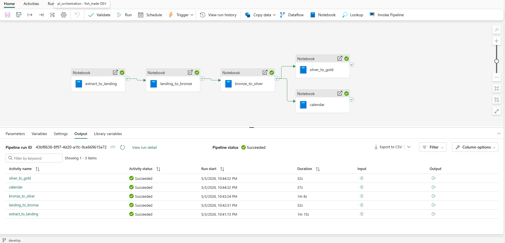
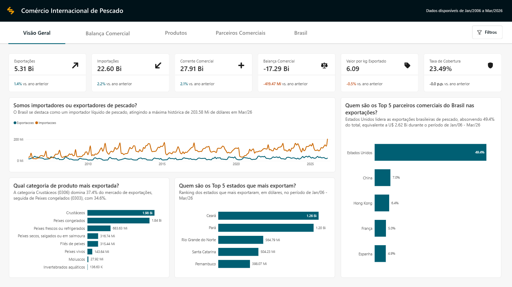

# 🎣 Projeto end-to-end de Análise da balança comercial de pescado


**Da ingestão ao dashboard:** esse projeto apresenta uma solução completa de um pipeline de dados utilizando o ecossistema **Microsoft Fabric**, partindo desde a ingestão de dados do comércio internacional de pescado da API COMEX STAT, até a elaboração de um dashboard no Power BI demonstrando as principais KPIs envolvidas no setor.

> O papel desse projeto é demonstrar o dia-a-dia de um Analytics Engineer, utilizando ferramentas para tratar de ingestão, qualidade de dados, documentação, performance, e análise de dados — em ambiente de nuvem gerenciado.

> 🔗 Versão open source do projeto (Python · PostgreSQL · dbt · Airflow · Docker): [fish-trade-analytics](https://github.com/jaircampelo/fish-trade-analytics)

## 🏛️ Arquitetura

O projeto utiliza o padrão ELT (Extract, Load, Transform) e a Arquitetura Medalhão sobre o Microsoft Fabric Lakehouse.

```
API ComexStat / BLS
│
▼
Landing (Files/Landing/)     ← Parquet bruto
│
▼
Bronze (Tables/bronze/)      ← Delta, dados as-is + colunas de controle
│
▼
Silver (Tables/silver/)      ← Delta, dados limpos, enriquecidos, validados
│
▼
Gold (Tables/gold/)          ← Delta, modelo dimensional Star Schema
│
▼
Semantic Model (Direct Lake) → Power BI
```

## 🔎 Problema

A tomada de decisões estratégicas no setor pesqueiro e de aquicultura muitas vezes é dificultada pela carência de dados centralizados e confiáveis. Este projeto resolve esse problema ao:

1. Automatizar a coleta de dados da balança comercial brasileira.
2. Garantir a integridade dos dados através de testes automatizados.
3. Transformar registros brutos em KPIs acionáveis para análise de mercado.

## 🛠️ Stack Tecnológico

| Componente | Ferramenta | Função |
|:--|:--|:--|
| 🔄 Ingestão | **PySpark (Python)** | API request (Full/Incremental) |
| 🗄️ Armazenamento | **Fabric Lakehouse + Delta Lake** | Camadas medalhão em formato Delta |
| 🔨 Transformação | **PySpark Notebooks** | Limpeza, modelagem e enriquecimento |
| 🔀 Orquestração | **Fabric Data Pipelines** | Encadeamento sequencial dos notebooks |
| 📊 Visualização | **Power BI (Direct Lake)** | Dashboards e métricas de negócio |
| 🚀 CI/CD | **Azure DevOps + pyfabricops** | Deploy automatizado via `azure_pipelines/` |

## 📐 Decisões de Desenvolvimento

### Arquitetura Medalhão

Organização lógica dos dados em camadas dentro de um único Lakehouse (`lh_fish_trade`):

`Landing`: zona de pouso com arquivos `.parquet` extraídos das APIs, sem transformações.

`Bronze`: tabelas Delta com os dados brutos carregados do Landing, acrescidos de colunas de controle (`ingested_at`, `loaded_at`).

`Silver`: dados limpos, padronizados, enriquecidos com tabelas auxiliares e validados.

`Gold`: modelo dimensional Star Schema pronto para consumo pelo Semantic Model em Direct Lake.

### Lakehouse único

Toda a arquitetura opera sobre um único Lakehouse (`lh_fish_trade`), com schemas separados por camada. Isso simplifica o gerenciamento de permissões, reduz latência entre camadas e facilita o rastreamento de linhagem.

### ELT no Fabric

As transformações são realizadas diretamente sobre o Lakehouse via PySpark, aproveitando o poder de processamento distribuído do Synapse sem necessidade de infraestrutura adicional.

### Ingestão Incremental

A lógica incremental é controlada por metatables (`landing_meta_table`, `bronze_meta_table`), usando joins entre tabelas para identificar novos períodos a carregar — sem loops. MERGE Delta com chave `file_path` evita duplicatas.

### CI/CD com pyfabricops

O deploy dos artefatos Fabric é automatizado via Azure DevOps, usando a biblioteca `pyfabricops`. O pipeline suporta três modos: `selective` (apenas itens alterados), `specific` (itens explicitamente listados) e `full` (todos os itens em `src/`).

## 🖥️ Projeto em Funcionamento

### Fabric Data Pipeline — Orquestração

A pipeline `pl_dag` encadeia os notebooks em sequência, garantindo a ordem correta de execução.



### Power BI — Dashboard de Comércio Internacional de Pescado

Dashboard interativo com as principais métricas de importação e exportação, conectado via **Direct Lake**.



## 📁 Estrutura do Projeto

```
📁 fish-trade-analytics-fabric/
│
├── 📁 assets/                                  # Ícones e imagens SVG do relatório Power BI
│
├── 📁 azure_pipelines/
│   └── 📄 deploy.yml                           # Pipeline de CI/CD via Azure DevOps
│
├── 📁 notebooks/                               # Jupyter Notebooks utilizados no Microsoft Fabric
│
├── 📁 scripts/
│   ├── 📄 deploy.py                            # Script de deploy com pyfabricops
│   └── 📄 utils.py                             # Funções auxiliares do deploy
│
├── 📁 src/
│   ├── 📁 data/
│   │   └── 📁 lh_fish_trade.Lakehouse/         # Definição do Lakehouse (metadados)
│   │
│   ├── 📁 notebooks/
│   │   ├── 📁 nb_extract_to_landing.Notebook/  # Extração API → Landing
│   │   ├── 📁 nb_landing_to_bronze.Notebook/   # Landing → Bronze (Delta)
│   │   ├── 📁 nb_bronze_to_silver.Notebook/    # Bronze → Silver (limpeza)
│   │   ├── 📁 nb_silver_to_gold.Notebook/      # Silver → Gold (dimensional)
│   │   └── 📁 nb_calendar.Notebook/            # Dimensão calendário
│   │
│   ├── 📁 pipelines/
│   │   └── 📁 pl_dag.DataPipeline/             # Pipeline de orquestração
│   │
│   └── 📁 reports/
│       └── 📁 rp_fish_trade.Report/            # Relatório Power BI (PBIR format)
│       └── 📁 sm_fish_trade.SemanticModel/     # Modelo Semântico Power BI (PBIR format)
│
├── 📄 .gitignore
├── 📄 LICENSE
└── 📄 README.md
```

## 🔨 Notebooks PySpark

### `nb_extract_to_landing`

Extrai dados de comércio exterior de pescado da **API ComexStat** (MDIC) e dados de inflação americana da **API BLS**, armazenando arquivos `.parquet` na zona Landing do Lakehouse. Registra metadados de cada extração na `landing_meta_table`.

- Códigos SH4: `0301` a `0308`
- Métricas: `metricFOB`, `metricKG`
- Granularidade: municipal
- CPI: série `CUUR0000SA0` (BLS)

### `nb_landing_to_bronze`

Carrega os arquivos `.parquet` do Landing para as tabelas Delta da camada Bronze, adicionando colunas de controle (`loaded_at`). Identifica novos arquivos via join entre `landing_meta_table` e `bronze_meta_table`. Registra metadados na `bronze_meta_table`.

**Tabelas geradas:** `bronze_trades`, `bronze_cities`, `bronze_countries`, `bronze_cpi`, `bronze_uf`

### `nb_bronze_to_silver`

Transforma os dados Bronze aplicando limpeza, padronização de nomenclaturas, casting de tipos e enriquecimento com tabelas auxiliares. Garante integridade referencial antes do modelo dimensional.

**Tabela gerada:** `silver_trades`

### `nb_silver_to_gold`

Constrói o modelo dimensional Star Schema a partir da camada Silver. Seeds de dados estáticos são criados diretamente como DataFrames (sem CSV, sem upload).

**Tabelas geradas:** `fact_trades`, `dim_cities`, `dim_countries`, `dim_product_categories`

### `nb_calendar`

Gera a dimensão calendário para uso no Semantic Model.

## 🗄️ Estrutura do Lakehouse

```
lh_fish_trade/
├── Files/
│   └── Landing/
│       ├── aux/
│       │   ├── aux_cities.parquet
│       │   ├── aux_countries.parquet
│       │   ├── aux_cpi.parquet
│       │   └── aux_uf.parquet
│       ├── export/
│       │   └── export_YYYYMM_YYYYMM.parquet
│       └── import/
│           └── import_YYYYMM_YYYYMM.parquet
└── Tables/
    ├── metadata/
    │   ├── landing_meta_table
    │   └── bronze_meta_table
    ├── bronze/
    │   ├── bronze_trades
    │   ├── bronze_cities
    │   ├── bronze_countries
    │   ├── bronze_cpi
    │   └── bronze_uf
    ├── silver/
    │   └── silver_trades
    └── gold/
        ├── fact_trades
        ├── dim_cities
        ├── dim_countries
        └── dim_product_categories
```

## 🚀 CI/CD

O deploy é automatizado via **Azure DevOps** com a biblioteca `pyfabricops`. A pipeline em `azure_pipelines/deploy.yml` é acionada em pushes para `main` que alterem arquivos dentro de `src/`.

**Modos de deploy:**

| Modo | Comportamento |
|:--|:--|
| `selective` | Detecta itens alterados via `git diff` e faz deploy apenas deles (padrão) |
| `specific` | Faz deploy de itens explicitamente listados por nome |
| `full` | Faz deploy de todos os itens em `src/` |

As credenciais (`FAB_TENANT_ID`, `FAB_CLIENT_ID`, `FAB_CLIENT_SECRET`) são gerenciadas via Azure DevOps Variable Group `FAB_CREDENTIALS`.

## 📝 Licença

MIT License — veja [LICENSE](LICENSE) para detalhes.